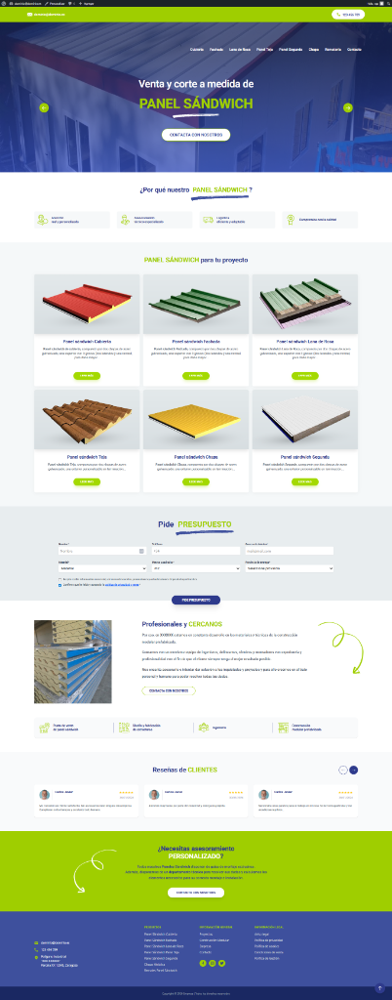

# VGS - Tema WordPress Personalizado

Este es el tema de WordPress para la landing page de **VGS**, basado en el framework `_tw` que combina **Tailwind CSS** y **esbuild** para un desarrollo rápido y optimizado.



## 🎥 Video Explicativo

Puedes ver una guía en video sobre cómo configurar y utilizar este tema:

[📺 Ver Video Explicativo](https://drive.google.com/file/d/1htcXfv5WmC_Ibf7CyiubFflyZkfmmtm2/view?usp=drive_link)

---


## 📋 Requisitos del Entorno

Para trabajar con este tema, necesitarás:
- **WordPress**: v6.0 o superior.
- **PHP**: v7.4 o superior (recomendado 8.1+).
- **Node.js**: v18 o superior.
- **npm**: v9 o superior.

## 🚀 Instalación del Theme

1. Clona este repositorio dentro de la carpeta de temas de tu instalación de WordPress:
   ```bash
   cd wp-content/themes/
   git clone https://github.com/sergiorioscomar/vgs-wp.git
   ```

2. Accede al directorio del tema e instala las dependencias de desarrollo:
   ```bash
   cd vgs-wp
   npm install
   ```

## 🛠️ Comandos de Desarrollo

El tema utiliza scripts de npm para procesar estilos y scripts:

- **Desarrollo (Watch mode):** Ejecuta la compilación automática cada vez que guardes cambios en archivos CSS o JS.
  ```bash
  npm run watch
  ```
- **Compilación de desarrollo:** Genera los archivos sin minificar.
  ```bash
  npm run dev
  ```
- **Producción y Empaquetado:** Minifica todos los assets y genera un archivo `.zip` listo para instalar en `_tw.zip`.
  ```bash
  npm run bundle
  ```

## 📦 Plugin de Productos (Landing Products)

Para que la sección de productos funcione correctamente, es necesario instalar el plugin personalizado:

1. Clona el repositorio del plugin en tu carpeta de plugins:
   ```bash
   cd wp-content/plugins/
   git clone https://github.com/sergiorioscomar/landing_products.git
   ```
2. Activa el plugin **Landing Products** desde el escritorio de WordPress.
3. El plugin añadirá un menú para gestionar los productos.
4. **Shortcode:** Puedes insertar el listado de productos en cualquier página usando:
   `[lp_products limit="6" cols="3"]`

## 📥 Importación de Demo Content

El tema incluye contenido de ejemplo para facilitar la configuración inicial. Puedes encontrar los archivos en la carpeta `/demo-content/`.

1. Ve a **Herramientas > Importar** en tu panel de WordPress.
2. Selecciona **WordPress** (instala el importador si es necesario).
3. Sube e importa los archivos:
   - `landing_products.2026-01-28.xml`: Importa los productos de ejemplo.
   - `hero_slider.2026-01-28.xml`: Importa las diapositivas del slider principal.

## 🎞️ Cómo editar el Slider

El slider principal (Hero Section) se gestiona mediante el Custom Post Type **"Hero Slides"**:

1. Ve a **Hero Slides** en el menú lateral.
2. Cada diapositiva permite configurar:
   - **Título**: El título grande con subrayado.
   - **Contenido**: La descripción que aparece arriba del título.
   - **Imagen destacada**: El fondo de la diapositiva.
3. El slider es automático y también permite navegación manual.

## 🏗️ Estructura y Decisiones Técnicas

- **Tailwind CSS 4**: Se utiliza para el diseño visual, permitiendo un desarrollo ágil y consistente.
- **esbuild**: Encargado de empaquetar el JavaScript para máxima velocidad.
- **_tw Framework**: Estructura basada en este starter theme que separa la lógica de construcción de los archivos del tema final.
- **Gestión del Proyecto**: Se aplicaron metodologías ágiles utilizando el método **Kanban** para el seguimiento de tareas y objetivos. Puedes ver el tablero del proyecto aquí:
  - [📋 Tablero Kanban - GitHub Projects](https://github.com/users/sergiorioscomar/projects/15)
- **Header/Footer Landing**: Se utilizan templates personalizados `header-landing.php` y `footer-landing.php` para mantener una estructura de landing page limpia.
- **Mobile-first**: Todo el diseño está optimizado para dispositivos móviles desde la base.
